## Typefaces for Source Code Beautification 

## Gallery

### [Coding Font Tobi](fonts/coding-font-tobi)

[ [License](https://raw.githubusercontent.com/chrissimpkins/codeface/master/fonts/coding-font-tobi/licence.txt) ]

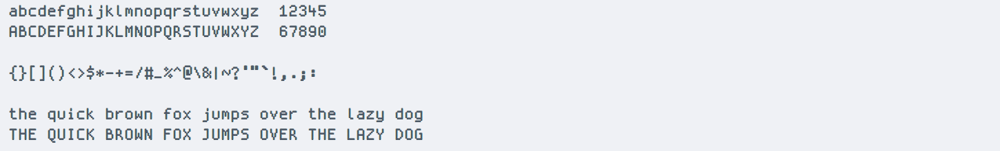
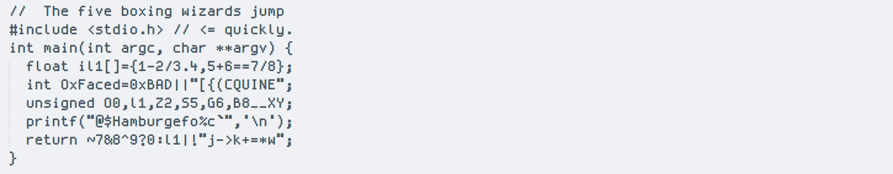
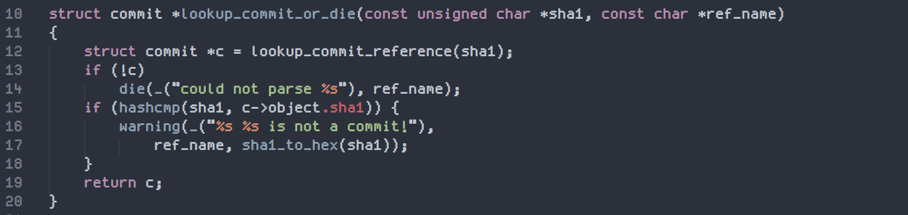

### [Crisp](fonts/crisp)

[ [License](https://raw.githubusercontent.com/chrissimpkins/codeface/master/fonts/crisp/license.txt) ]

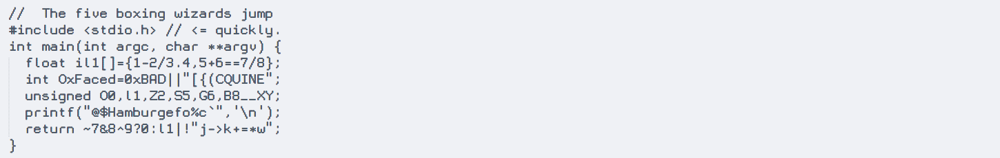
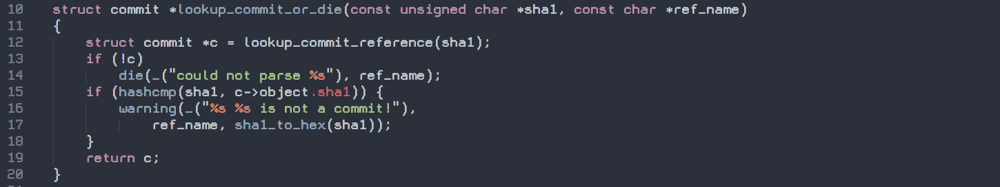

### [Dina](fonts/dina)

[ [License](https://raw.githubusercontent.com/chrissimpkins/codeface/master/fonts/dina/license.txt) ]

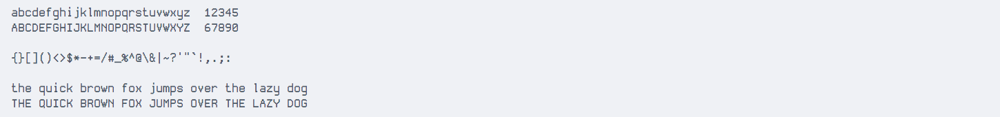
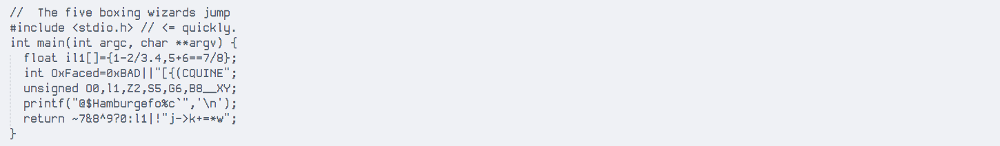
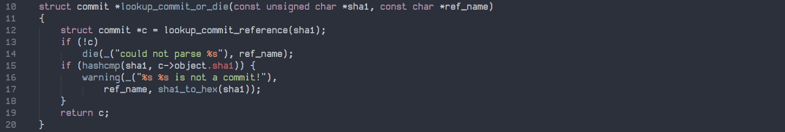

### [Fixedsys Excelsior](fonts/fixed-sys-excelsior)

[ [License](https://raw.githubusercontent.com/chrissimpkins/codeface/master/fonts/fixed-sys-excelsior/license.txt) ]

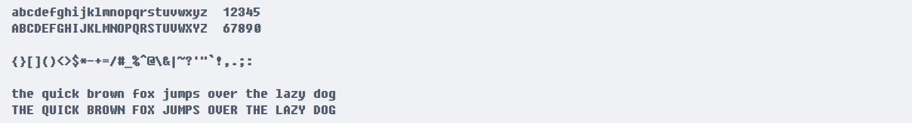
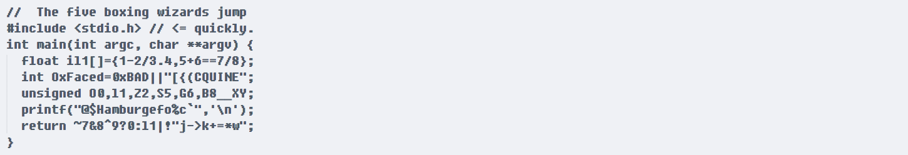
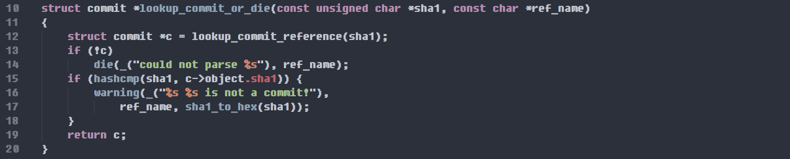

### [Gohufont](fonts/gohufont)

[ [License](https://raw.githubusercontent.com/chrissimpkins/codeface/master/fonts/gohufont/license.txt) ]

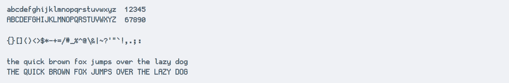
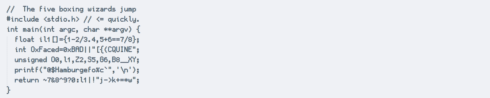
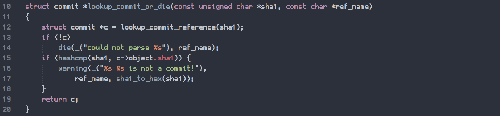

### [Monte Carlo](fonts/monte-carlo)

[ [License](https://raw.githubusercontent.com/chrissimpkins/codeface/master/fonts/monte-carlo/license.txt) ]

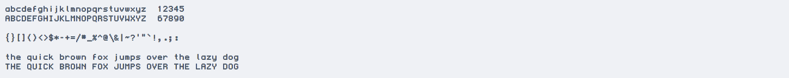
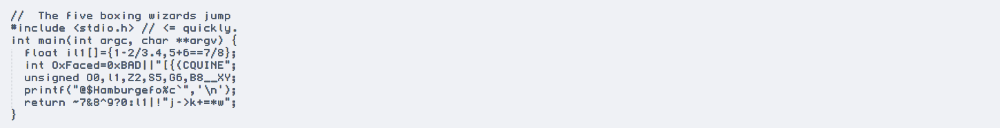
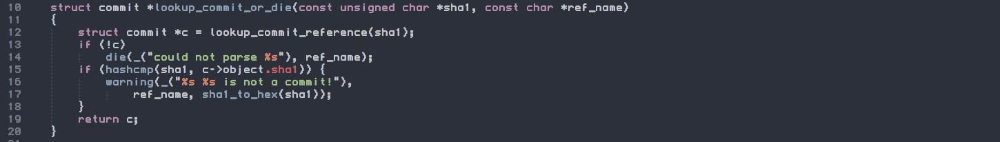

### [Proggy Clean](fonts/proggy-clean)

[ [License](https://raw.githubusercontent.com/chrissimpkins/codeface/master/fonts/proggy-clean/license.txt) ]

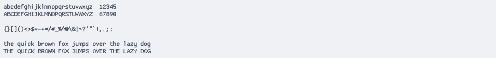
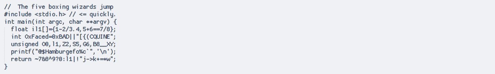

### [Proggy Small](fonts/proggy-small)

[ [License](https://raw.githubusercontent.com/chrissimpkins/codeface/master/fonts/proggy-small/license.txt) ]

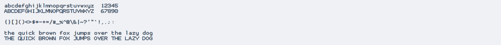
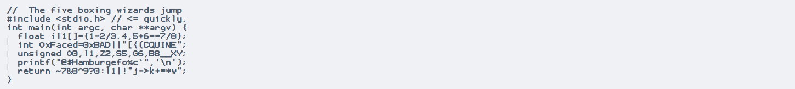
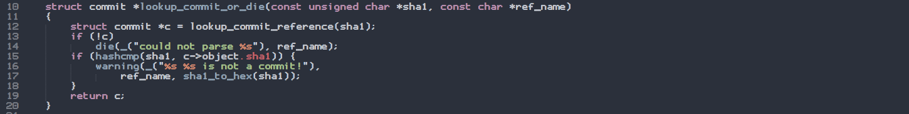

### [Proggy Square](fonts/proggy-square)

[ [License](https://raw.githubusercontent.com/chrissimpkins/codeface/master/fonts/proggy-square/license.txt) ]

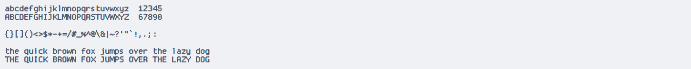
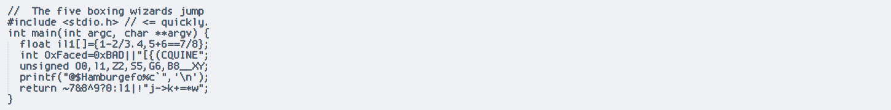
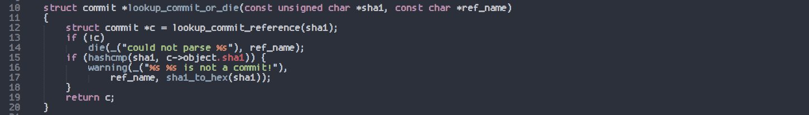

### [Proggy Tiny](fonts/proggy-tiny)

[ [License](https://raw.githubusercontent.com/chrissimpkins/codeface/master/fonts/proggy-tiny/license.txt) ]

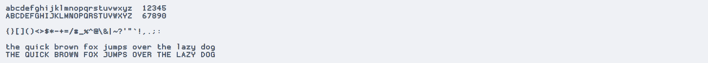
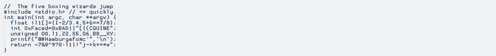
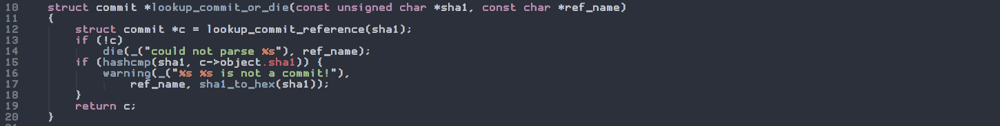

