# Typefaces for source code beautification

The following typefaces are free to use; however, they do not permit redistribution through the Codeface repository.  Follow the link to the site where you can download the font binary.

### [Envy Code R](http://damieng.com/blog/2008/05/26/envy-code-r-preview-7-coding-font-released)

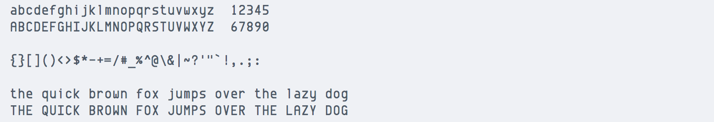
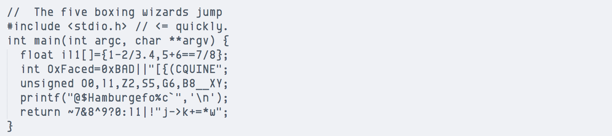
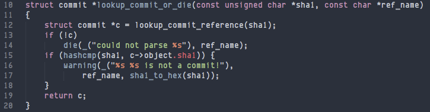

### [Input Mono](http://input.fontbureau.com/download/)

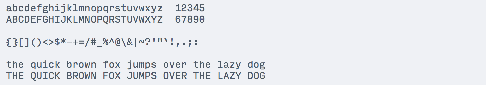
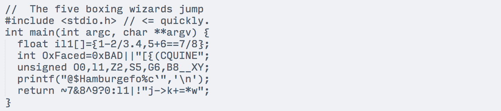
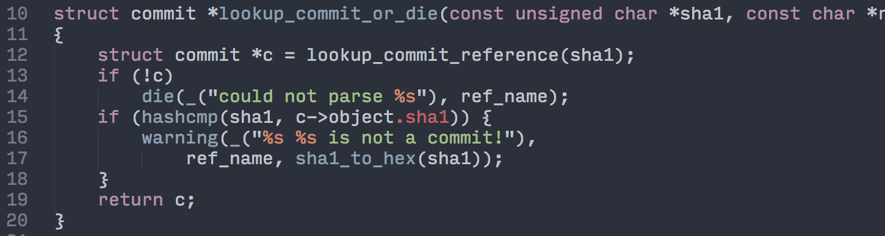

### [Klartext Mono Light](http://www.fontspring.com/fonts/heimatdesign/klartext-mono)

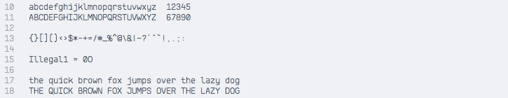
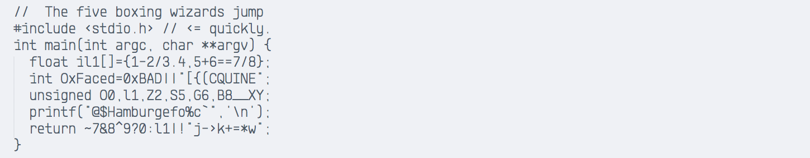
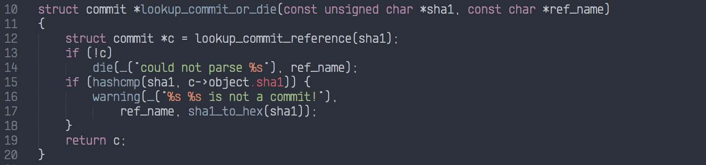

### [Monofonto](http://www.fontspring.com/fonts/typodermic/monofonto)

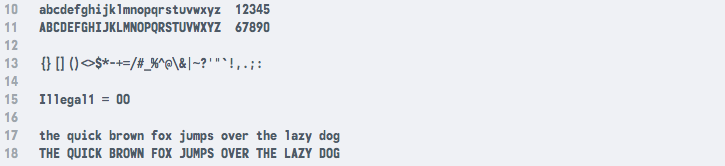
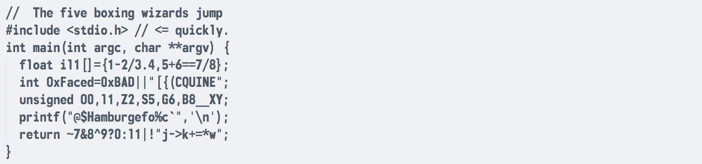
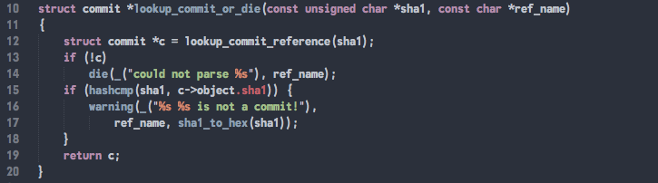

### [Monoxil Regular](http://www.fontspring.com/fonts/urtd/monoxil)

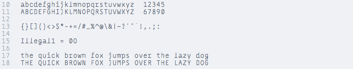
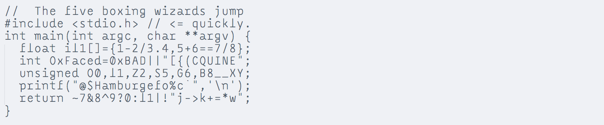
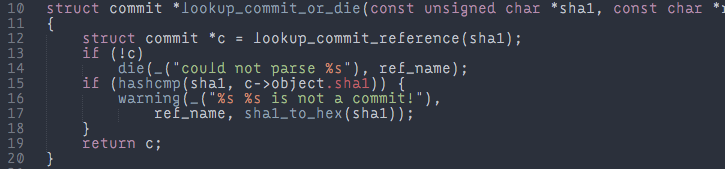

### [NK57 Monospace](http://www.fontspring.com/fonts/typodermic/nk57-monospace)

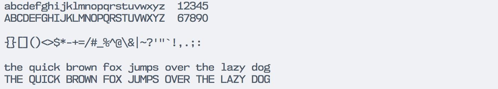
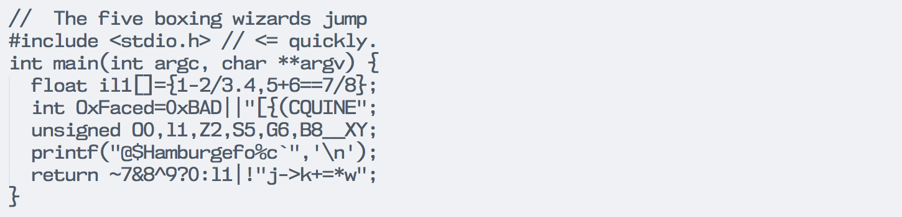
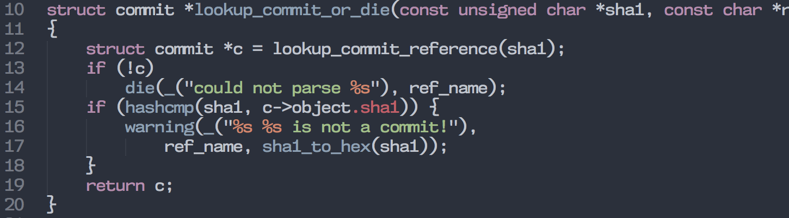

