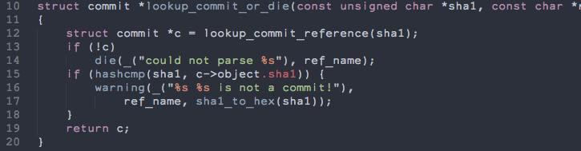
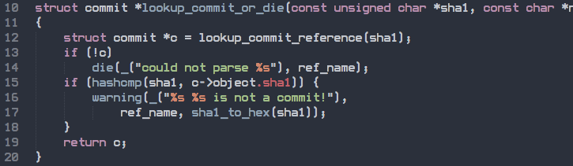
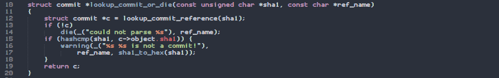
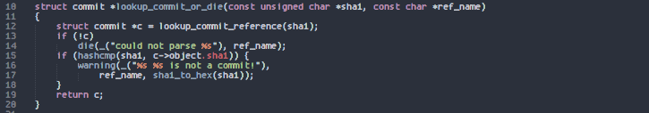
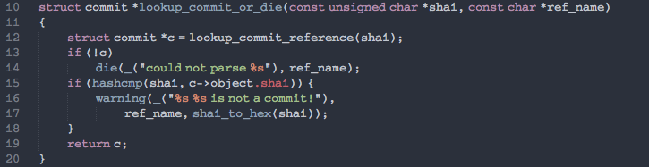
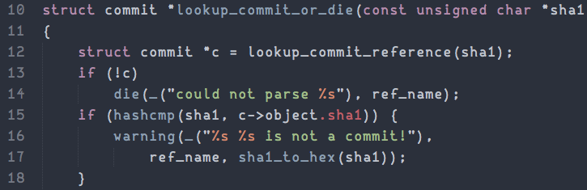
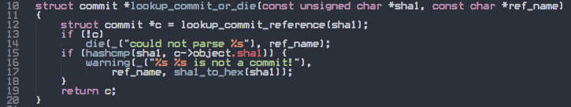

### [Anonymous Pro](fonts/anonymous-pro)

### [Aurulent Sans Mono](fonts/aurulent-sans-mono)

### [Bitstream Vera Sans Mono](fonts/bitstream-vera-sans-mono)

### [BP Mono](fonts/bp-mono)

### [Code New Roman](fonts/code-new-roman)

### [Coding Font Tobi](fonts/coding-font-tobi)

### [Consola Mono](fonts/consola-mono)

### [Cousine](fonts/cousine)

### [Crisp](fonts/crisp)

### [Cutive Mono](fonts/cutive-mono)

### [Dejavu Sans Mono](fonts/dejavu-sans-mono)

### [Droid Sans Mono](fonts/droid-sans-mono)

### [Elronet Monospace](fonts/elronet-monospace)

### [Fantasque Sans Mono](fonts/fantasque-sans-mono)

### [Fira Mono](fonts/fira-mono)

### [Free Mono](fonts/free-mono)

### [Inconsolata](fonts/inconsolata)

### [Inconsolata-g](fonts/inconsolata-g)

### [Liberation Mono](fonts/liberation-mono)

### [Lekton](fonts/lekton)

### [Luxi Mono](fonts/luxi-mono)

### [M+ 1m](fonts/mplus1m)

### [M+ 2m](fonts/mplus2m)

### [Monofur](fonts/monofur)

### [Monoid](fonts/monoid)

### [monoOne](fonts/mono-one)

### [Mono MMM 5](fonts/mono-mmm-5)

### [Monospace](fonts/monospace)

### [Monospace Typewriter](fonts/monospace-typewriter)

### [Mono Spatial](fonts/mono-spatial)

### [Not Courier Sans](fonts/not-courier-sans)

### [Oxygen Mono](fonts/oxygen-mono)

### [Panic Sans Mono](fonts/panic-sans-mono)

### [PixelCarnage Mono](fonts/pixel-carnage)

### [ProFontWindows](fonts/pro-font-windows)

### [Proggy Clean](fonts/proggy-clean)

### [Proggy Small](fonts/proggy-small)

### [Proggy Square](fonts/proggy-square)

### [PT Mono](fonts/pt-mono)

### [Roboto Mono](fonts/roboto-mono)

### [sax Mono](fonts/sax-mono)

### [Selectric](fonts/selectric)

### [Share Tech Mono](fonts/share-tech-mono)

### [Small Type Writing](fonts/small-type-writing)

### [Source Code Pro](fonts/source-code-pro)

### [String Literal](fonts/string-literal)

### [SV Basic Manual](fonts/sv-basic-manual)

### [Terminus](fonts/terminus)

### [TeX Gyre Cursor](fonts/tex-gyre-cursor)

### [Ubuntu Mono](fonts/ubuntu-mono)

### [Verily Serif Mono](fonts/verily-serif-mono)

### [White Rabbit](fonts/white-rabbit)

