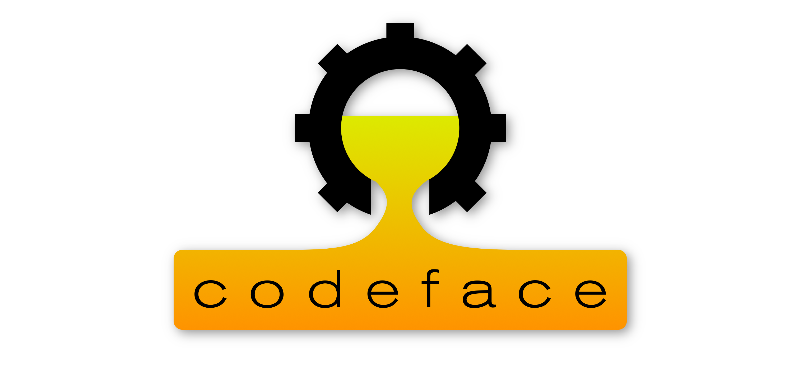

## Typefaces for Source Code Beautification 

* [About](ABOUT.md)
* [Main Font Gallery](#the-gallery)
* [Free, Non-Distrib EULA Font Gallery](NONDISTRIB.md)
* [Contribute to the Project](CONTRIBUTING.md)
* [Contributor List](CONTRIBUTORS.md)
* [License](LICENSE.md)

## Fun Little Rant About Font Customization

<blockquote>"Stop wasting your braintime on meaningless stuff like this and get back to coding. If you replace 'font' with some cosmetic product y'all sound like a bunch of valley girls."

-- Some Guy on Reddit</a>
</blockquote>

[Link](https://www.reddit.com/r/programming/comments/39wz4l/hey_reddit_developers_what_is_your_favorite_text/cs86fnu)

## Download Font ZIP Archive

All font binaries in the Codeface collection (29.4MB ZIP archive)

## The Gallery

### [Anonymous Pro](fonts/anonymous-pro)

[ [License](https://raw.githubusercontent.com/chrissimpkins/codeface/master/fonts/anonymous-pro/license.txt) ]

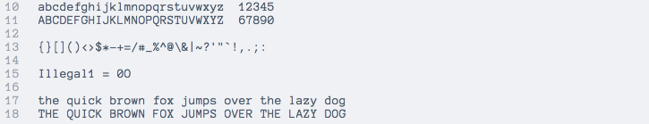
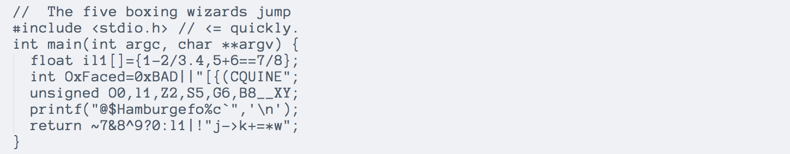
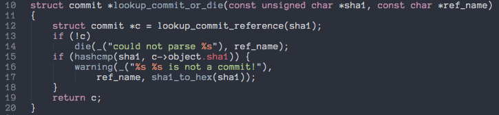

### [Aurulent Sans Mono](fonts/aurulent-sans-mono)

[ [License](https://raw.githubusercontent.com/chrissimpkins/codeface/master/fonts/aurulent-sans-mono/source.txt) ]

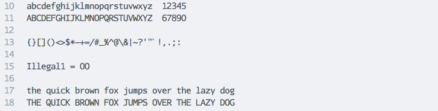
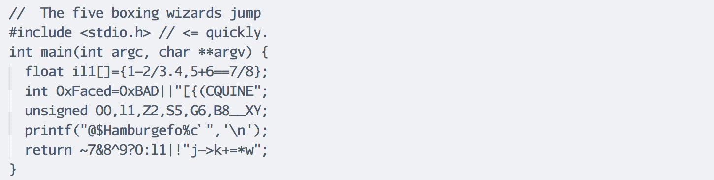

### [Average Mono](fonts/average-mono)

[ [License](https://raw.githubusercontent.com/chrissimpkins/codeface/master/fonts/average-mono/license.txt) ]

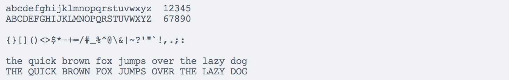
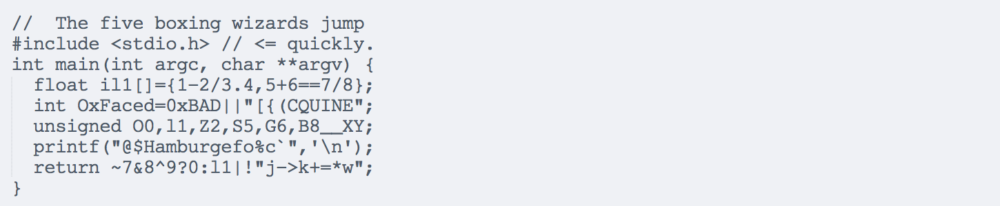
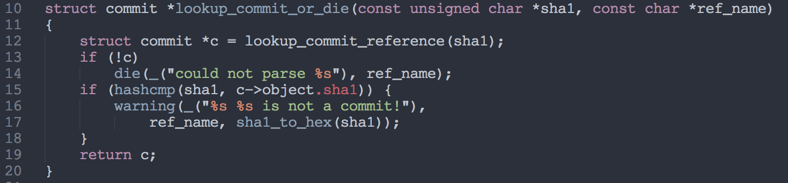

### [Bitstream Vera Sans Mono](fonts/bitstream-vera-sans-mono)

[ [License](https://raw.githubusercontent.com/chrissimpkins/codeface/master/fonts/bitstream-vera-sans-mono/COPYRIGHT.TXT) ]

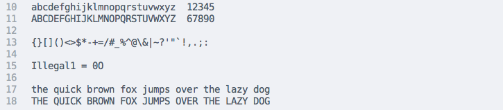
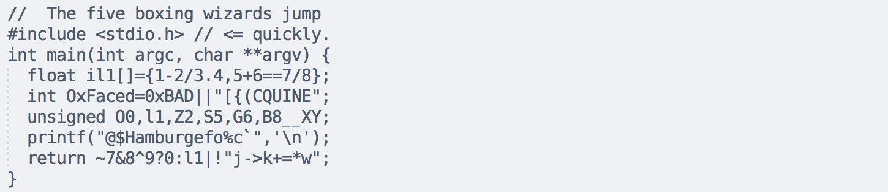

### [BP Mono](fonts/bp-mono)

[ [License](https://raw.githubusercontent.com/chrissimpkins/codeface/master/fonts/bp-mono/Creative%20Commons%20Attribution-No%20Derivative%20Works.txt) ]

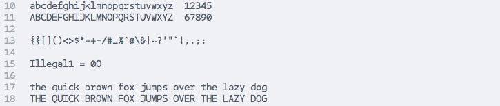
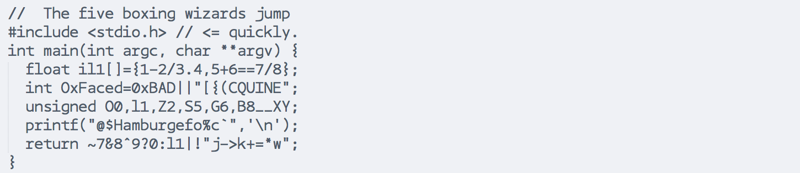

### [Bront](fonts/bront)

[ [License](https://raw.githubusercontent.com/chrissimpkins/codeface/master/fonts/bront/LICENSE.txt) ]

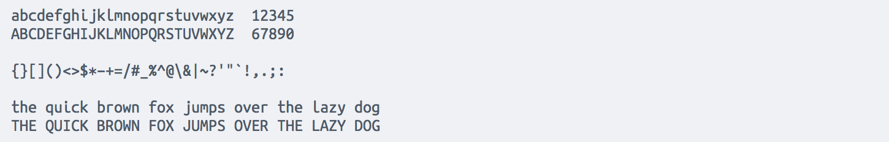
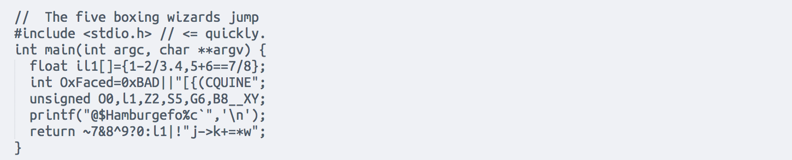
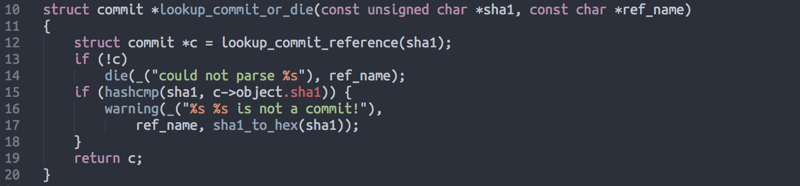

### [Camingo Code](fonts/camingo-code)

[ [License](https://raw.githubusercontent.com/chrissimpkins/codeface/master/fonts/camingo-code/license.txt) ]

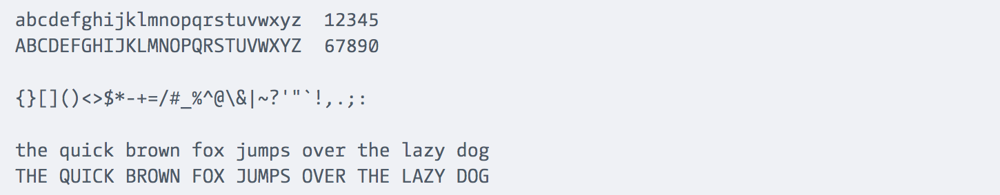
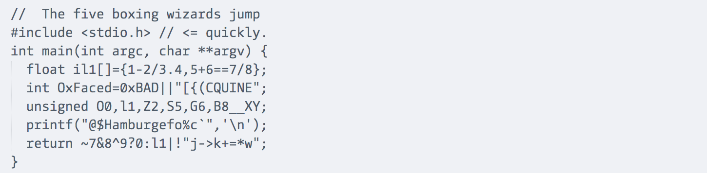

### [CMU Typewriter](fonts/cmu-typewriter)

[ [License](https://raw.githubusercontent.com/chrissimpkins/codeface/master/fonts/cmu-typewriter/license.txt) ]

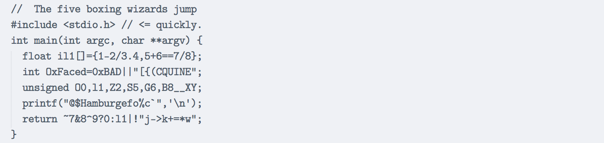
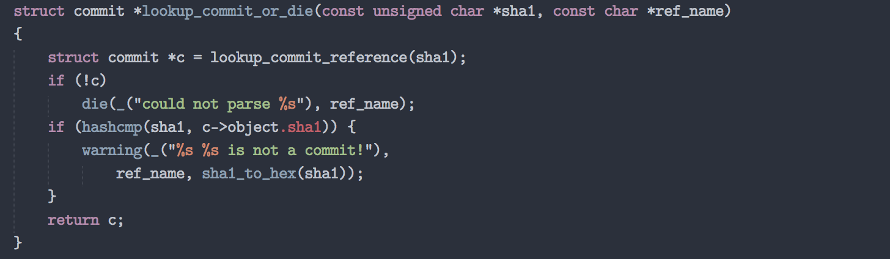

### [Code New Roman](fonts/code-new-roman)

[ [License](https://raw.githubusercontent.com/chrissimpkins/codeface/master/fonts/code-new-roman/cnr-note.txt) ]

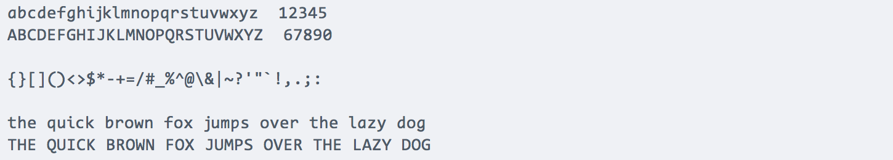
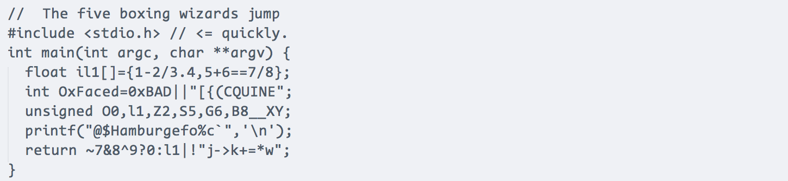

### [Coding Font Tobi](fonts/coding-font-tobi)

[ [License](https://raw.githubusercontent.com/chrissimpkins/codeface/master/fonts/coding-font-tobi/Licence.txt) ]

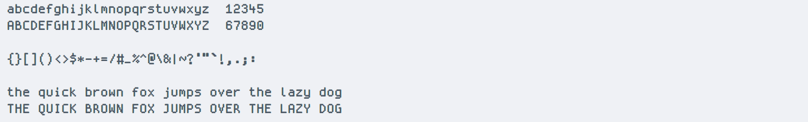
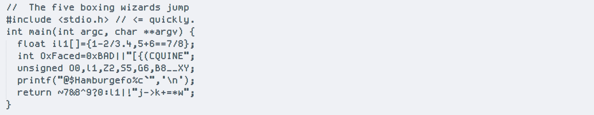
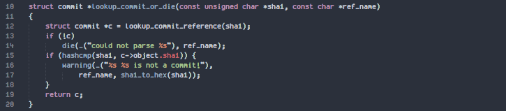

### [Consola Mono](fonts/consola-mono)

[ [License](https://raw.githubusercontent.com/chrissimpkins/codeface/master/fonts/consola-mono/SIL%20-%20Open%20Font%20License.txt) ]

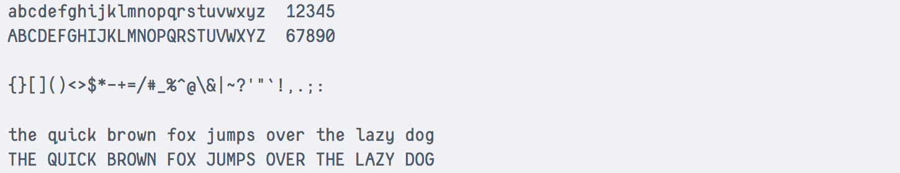
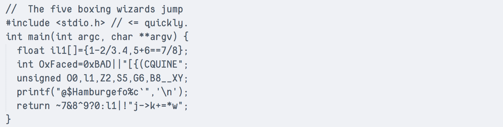

### [Cousine](fonts/cousine)

[ [License](https://raw.githubusercontent.com/chrissimpkins/codeface/master/fonts/cousine/license.txt) ]

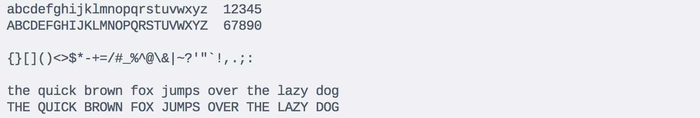

### [CP Mono](fonts/cp-mono)

[ [License](https://raw.githubusercontent.com/chrissimpkins/codeface/master/fonts/cp-mono/CC_License.txt) ]

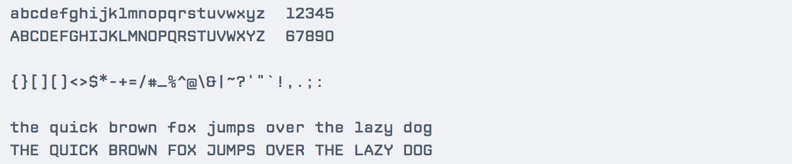
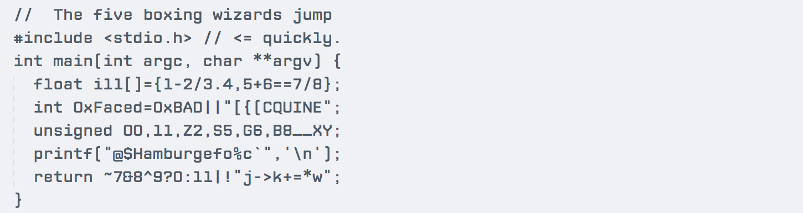
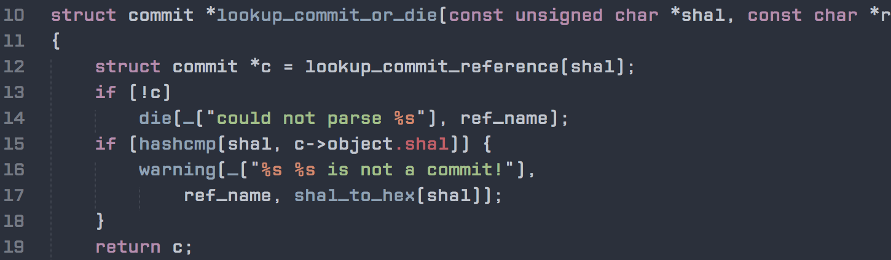

### [Crisp](fonts/crisp)

[ [License](https://raw.githubusercontent.com/chrissimpkins/codeface/master/fonts/crisp/license.txt) ]

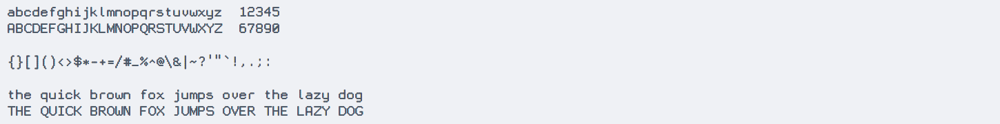

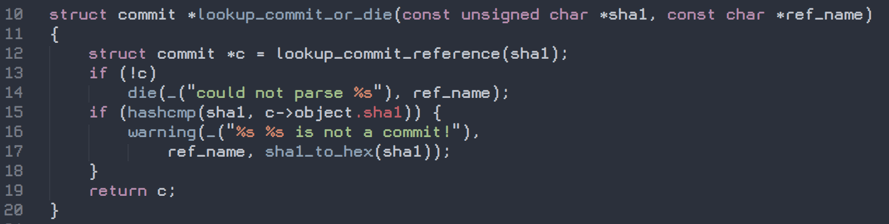

### [Cutive Mono](fonts/cutive-mono)

[ [License](https://raw.githubusercontent.com/chrissimpkins/codeface/master/fonts/cutive-mono/OFL.txt) ]

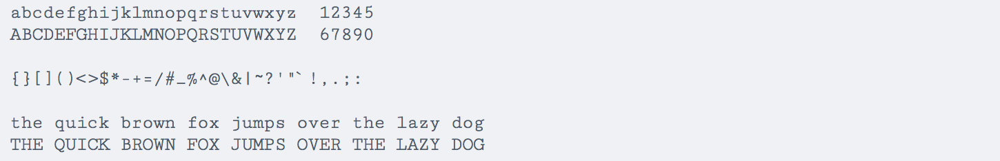
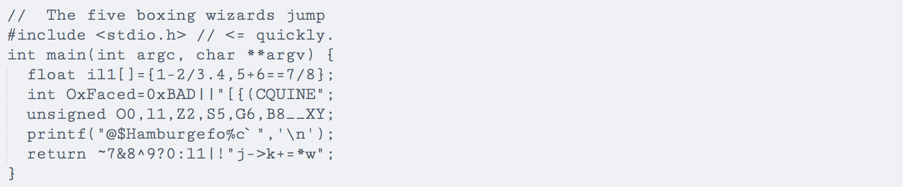

### [Dejavu Sans Mono](fonts/dejavu-sans-mono)

[ [License](https://raw.githubusercontent.com/chrissimpkins/codeface/master/fonts/dejavu-sans-mono/license.txt) ]

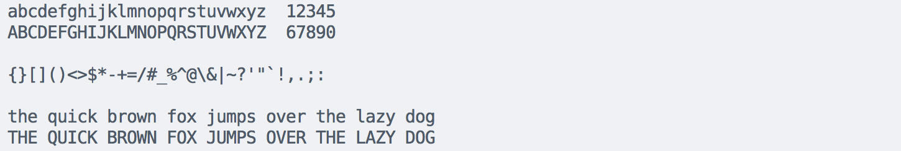
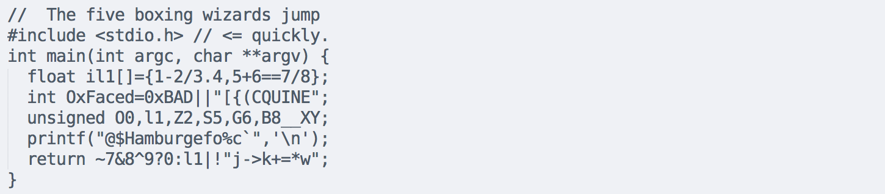
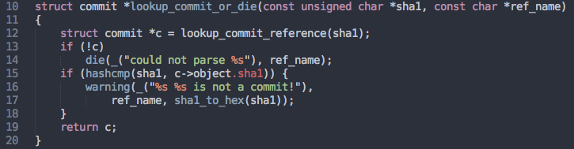

### [Dina](fonts/dina)

[ [License](https://raw.githubusercontent.com/chrissimpkins/codeface/master/fonts/dina/LICENSE) ]

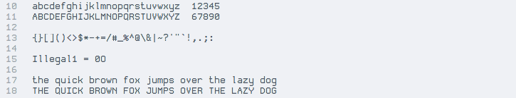

### [Droid Sans Mono](fonts/droid-sans-mono)

[ [License](https://raw.githubusercontent.com/chrissimpkins/codeface/master/fonts/droid-sans-mono/license.txt) ]

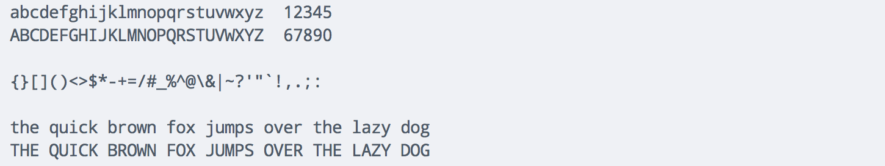
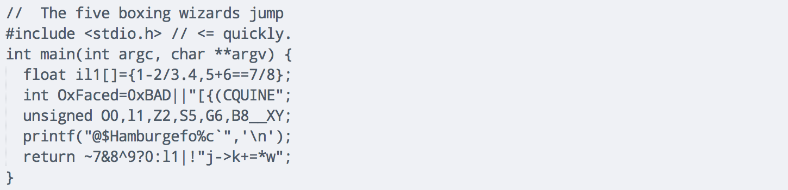
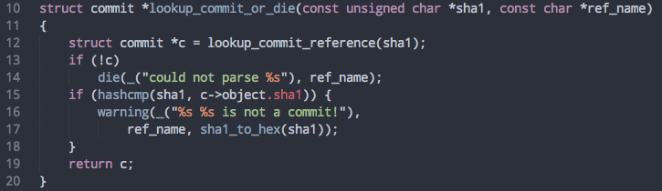

### [Edlo](fonts/edlo)

[ [License](https://raw.githubusercontent.com/chrissimpkins/codeface/master/fonts/edlo/license.txt) ]

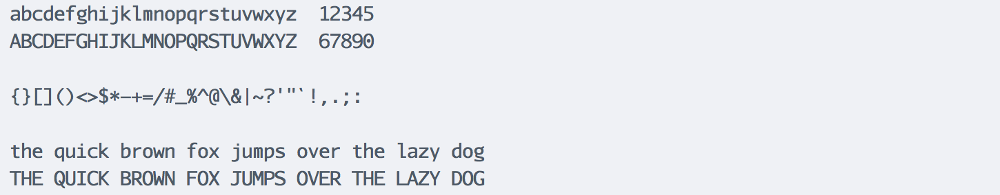
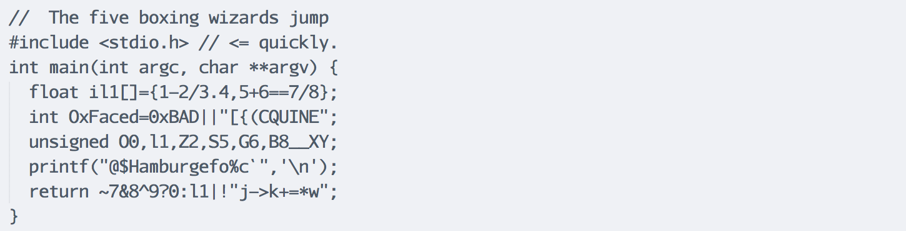

### [Fantasque Sans Mono](fonts/fantasque-sans-mono)

[ [License](https://raw.githubusercontent.com/chrissimpkins/codeface/master/fonts/fantasque-sans-mono/OFL.txt) ]

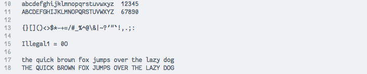
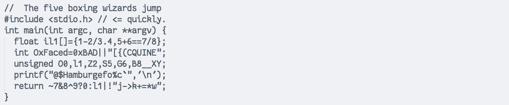
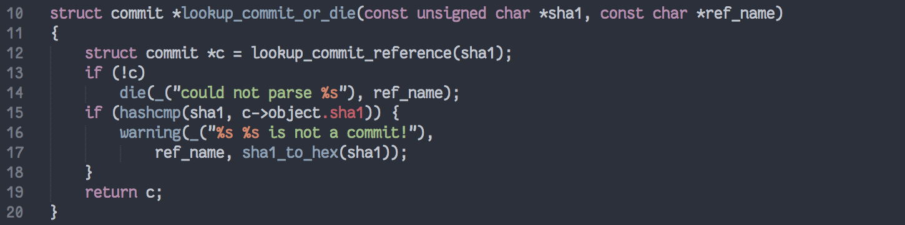

### [Fira Mono](fonts/fira-mono)

[ [License](https://raw.githubusercontent.com/chrissimpkins/codeface/master/fonts/fira-mono/SIL%20Open%20Font%20License.txt) ]

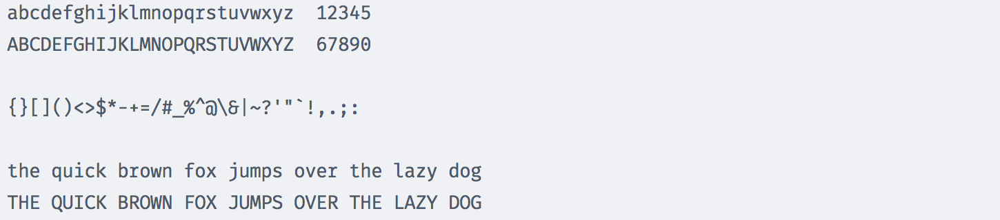
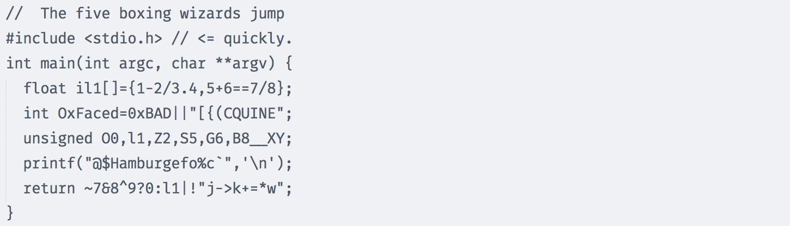
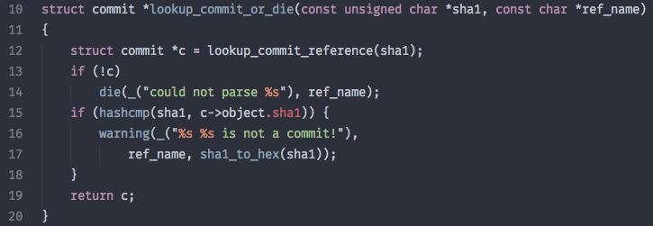

### [Fixedsys Excelsior](fonts/fixed-sys-excelsior)

[ [License](https://raw.githubusercontent.com/chrissimpkins/codeface/master/fonts/fixed-sys-excelsior/license.txt) ]

### [Free Mono](fonts/free-mono)

[ [License](https://raw.githubusercontent.com/chrissimpkins/codeface/master/fonts/free-mono/license.txt) ]

### [Gohufont](fonts/gohufont)

[ [License](https://raw.githubusercontent.com/chrissimpkins/codeface/master/fonts/gohufont/license.txt) ]

### [Hack](fonts/hack)

[ [License](https://raw.githubusercontent.com/chrissimpkins/codeface/master/fonts/hack/license.txt) ]

### [Hasklig](fonts/hasklig)

[ [License](https://raw.githubusercontent.com/chrissimpkins/codeface/master/fonts/hasklig/License.txt) ]

### [Hermit](fonts/hermit)

[ [License](https://raw.githubusercontent.com/chrissimpkins/codeface/master/fonts/hermit/license.txt) ]

### [Inconsolata](fonts/inconsolata)

[ [License](https://raw.githubusercontent.com/chrissimpkins/codeface/master/fonts/inconsolata/license.txt) ]

### [Inconsolata-dz](fonts/inconsolata-dz)

[ [License](https://raw.githubusercontent.com/chrissimpkins/codeface/master/fonts/inconsolata-dz/license.txt) ]

### [Inconsolata-g](fonts/inconsolata-g)

[ [License](https://raw.githubusercontent.com/chrissimpkins/codeface/master/fonts/inconsolata-g/license.txt) ]

### [Inconsolata LGC](fonts/inconsolata-lgc)

[ [License](https://raw.githubusercontent.com/chrissimpkins/codeface/master/fonts/inconsolata-lgc/license.txt) ]

### [Latin Modern Mono Light](fonts/latin-modern-mono)

[ [License](https://raw.githubusercontent.com/chrissimpkins/codeface/master/fonts/latin-modern-mono/license.txt) ]

### [Lekton](fonts/lekton)

[ [License](https://raw.githubusercontent.com/chrissimpkins/codeface/master/fonts/lekton/SIL%20Open%20Font%20License.txt) ]

### [Liberation Mono](fonts/liberation-mono)

[ [License](https://raw.githubusercontent.com/chrissimpkins/codeface/master/fonts/liberation-mono/License.txt) ]

### [Linux Libertine Mono](fonts/linux-libertine-mono)

[ [License](https://raw.githubusercontent.com/chrissimpkins/codeface/master/fonts/linux-libertine-mono/license.txt) ]

### [Luculent](fonts/luculent)

[ [License](https://raw.githubusercontent.com/chrissimpkins/codeface/master/fonts/luculent/license.txt) ]

### [Luxi Mono](fonts/luxi-mono)

[ [License](https://raw.githubusercontent.com/chrissimpkins/codeface/master/fonts/luxi-mono/Bigelow%20%26%20Holmes%20-%20Luxi%20License.txt) ]

### [M+ 1m](fonts/mplus1m)

[ [License](https://raw.githubusercontent.com/chrissimpkins/codeface/master/fonts/mplus1m/M%2B%20Fonts%20License.txt) ]

### [M+ 1mn](fonts/mplus1mn)

[ [License](https://raw.githubusercontent.com/chrissimpkins/codeface/master/fonts/mplus1mn/M%2B%20Fonts%20License.txt) ]

### [M+ 2m](fonts/mplus2m)

[ [License](https://raw.githubusercontent.com/chrissimpkins/codeface/master/fonts/mplus2m/LICENSE_E.txt) ]

### [Mensch](fonts/mensch)

[ [License](https://raw.githubusercontent.com/chrissimpkins/codeface/master/fonts/mensch/License.txt) ]

### [Meslo](fonts/meslo)

[ [License](https://raw.githubusercontent.com/chrissimpkins/codeface/master/fonts/meslo/license.txt) ]

### [Metrickal](fonts/metrickal)

[ [License](https://raw.githubusercontent.com/chrissimpkins/codeface/master/fonts/metrickal/License.txt) ]

### [Monofur](fonts/monofur)

[ [License](https://raw.githubusercontent.com/chrissimpkins/codeface/master/fonts/monofur/monof_tt.txt) ]

### [Monoid](fonts/monoid)

[ [License](https://raw.githubusercontent.com/chrissimpkins/codeface/master/fonts/monoid/license.txt) ]

### [monoOne](fonts/mono-one)

[ [License](https://raw.githubusercontent.com/chrissimpkins/codeface/master/fonts/mono-one/license.txt) ]

### [Monospace](fonts/monospace)

[ [License](https://raw.githubusercontent.com/chrissimpkins/codeface/master/fonts/monospace/OFL.txt) ]

### [Monospace Typewriter](fonts/monospace-typewriter)

[ [License](https://raw.githubusercontent.com/chrissimpkins/codeface/master/fonts/monospace-typewriter/license.txt) ]

### [Mono Spatial](fonts/mono-spatial)

[ [License](https://raw.githubusercontent.com/chrissimpkins/codeface/master/fonts/mono-spatial/source.txt) ]

### [Monte Carlo](fonts/monte-carlo)

[ [License](https://raw.githubusercontent.com/chrissimpkins/codeface/master/fonts/monte-carlo/license.txt) ]

### [Nanum Gothic Coding](fonts/nanum-gothic-coding)

[ [License](https://raw.githubusercontent.com/chrissimpkins/codeface/master/fonts/nanum-gothic-coding/license.txt) ]

### [Not Courier Sans](fonts/not-courier-sans)

[ [License](https://raw.githubusercontent.com/chrissimpkins/codeface/master/fonts/not-courier-sans/license.txt) ]

### [Office Code Pro](fonts/office-code-pro)

[ [License](https://raw.githubusercontent.com/chrissimpkins/codeface/master/fonts/office-code-pro/LICENSE.txt) ]

### [Oxygen Mono](fonts/oxygen-mono)

[ [License](https://raw.githubusercontent.com/chrissimpkins/codeface/master/fonts/oxygen-mono/SIL%20Open%20Font%20License.txt) ]

### [Panic Sans Mono](fonts/panic-sans-mono)

[ [License](https://raw.githubusercontent.com/chrissimpkins/codeface/master/fonts/panic-sans-mono/license.txt) ]

### [PixelCarnage Mono](fonts/pixel-carnage)

[ [License](https://raw.githubusercontent.com/chrissimpkins/codeface/master/fonts/pixel-carnage/license.txt) ]

### [ProFontWindows](fonts/pro-font-windows)

[ [License](https://raw.githubusercontent.com/chrissimpkins/codeface/master/fonts/pro-font-windows/license.txt) ]

### [Proggy Clean](fonts/proggy-clean)

[ [License](https://raw.githubusercontent.com/chrissimpkins/codeface/master/fonts/proggy-clean/Licence.txt) ]

### [Proggy Small](fonts/proggy-small)

[ [License](https://raw.githubusercontent.com/chrissimpkins/codeface/master/fonts/proggy-small/Licence.txt) ]

### [Proggy Square](fonts/proggy-square)

[ [License](https://raw.githubusercontent.com/chrissimpkins/codeface/master/fonts/proggy-square/Licence.txt) ]

### [Proggy Tiny](fonts/proggy-tiny)

[ [License](https://raw.githubusercontent.com/chrissimpkins/codeface/master/fonts/proggy-tiny/Licence.txt) ]

### [PT Mono](fonts/pt-mono)

[ [License](https://raw.githubusercontent.com/chrissimpkins/codeface/master/fonts/pt-mono/license.txt) ]

### [Roboto Mono](fonts/roboto-mono)

[ [License](https://raw.githubusercontent.com/chrissimpkins/codeface/master/fonts/roboto-mono/LICENSE.txt) ]

### [sax Mono](fonts/sax-mono)

[ [License](https://raw.githubusercontent.com/chrissimpkins/codeface/master/fonts/sax-mono/license.txt) ]

### [Share-TechMonoTrue](fonts/share-tech-mono)

[ [License](https://raw.githubusercontent.com/chrissimpkins/codeface/master/fonts/share-tech-mono/license.txt) ]

### [Small Type Writing](fonts/small-type-writing)

[ [License](https://raw.githubusercontent.com/chrissimpkins/codeface/master/fonts/small-type-writing/license.txt) ]

### [Source Code Pro](fonts/source-code-pro)

[ [License](https://raw.githubusercontent.com/chrissimpkins/codeface/master/fonts/source-code-pro/SIL%20Open%20Font%20License.txt) ]

### [Sudo](fonts/sudo)

[ [License](https://raw.githubusercontent.com/chrissimpkins/codeface/master/fonts/sudo/license.txt) ]

### [SV Basic Manual](fonts/sv-basic-manual)

[ [License](https://raw.githubusercontent.com/chrissimpkins/codeface/master/fonts/sv-basic-manual/source.txt) ]

### [Terminus](fonts/terminus)

[ [License](https://raw.githubusercontent.com/chrissimpkins/codeface/master/fonts/terminus/license.txt) ]

### [TeX Gyre Cursor](fonts/tex-gyre-cursor)

[ [License](https://raw.githubusercontent.com/chrissimpkins/codeface/master/fonts/tex-gyre-cursor/GUST%20e-foundry%20License.txt) ]

### [Ubuntu Mono](fonts/ubuntu-mono)

[ [License](https://raw.githubusercontent.com/chrissimpkins/codeface/master/fonts/ubuntu-mono/UBUNTU%20FONT%20LICENCE.txt) ]

### [Verily Serif Mono](fonts/verily-serif-mono)

[ [License](https://raw.githubusercontent.com/chrissimpkins/codeface/master/fonts/verily-serif-mono/Verily%20Serif%20Mono%20%28Stephen%20G.%20Hartke%29.txt) ]

### [Whois Mono](fonts/whois-mono)

[ [License](https://raw.githubusercontent.com/chrissimpkins/codeface/master/fonts/whois-mono/License.txt) ]

---

§ A proud member of the [Awesome Syndicate](https://github.com/sindresorhus/awesome)
