## Typefaces for Source Code Beautification [](https://github.com/sindresorhus/awesome)

* [About](ABOUT.md)
* [Main Font Gallery](#the-gallery)
* [Chinese, Japanese, Korean Developer Font Gallery](CJK.md)
* [Free, Non-Distrib EULA Developer Font Gallery](NONDISTRIB.md)
* [Contribute to the Project](CONTRIBUTING.md)
* [Contributor List](CONTRIBUTORS.md)
* [License](LICENSE.md)


## Fun Little Rant About Font Customization

<blockquote>"Stop wasting your braintime on meaningless stuff like this and get back to coding. If you replace 'font' with some cosmetic product y'all sound like a bunch of valley girls."
<p>-- <a href="https://www.reddit.com/r/programming/comments/39wz4l/hey_reddit_developers_what_is_your_favorite_text/cs86fnu"></a>Some Guy on Reddit</a></p></blockquote>

[Link](https://www.reddit.com/r/programming/comments/39wz4l/hey_reddit_developers_what_is_your_favorite_text/cs86fnu)


## Download Font Archive

<a href="https://github.com/chrissimpkins/codeface/releases/download/font-collection/codeface-fonts.zip"></a>

Click a link below to download all font binaries in the Codeface main gallery collection:

| Archive  | SHA1  | Size |
| :------------: |:---------------:| :-----:|
| [codeface-fonts.zip](https://github.com/chrissimpkins/codeface/releases/download/font-collection/codeface-fonts.zip) | `d2e6b2dbf0b749f095c5f02e82ac06e5553ca22c` | 27.9 MB |
| [codeface-fonts.tar.xz](https://github.com/chrissimpkins/codeface/releases/download/font-collection/codeface-fonts.tar.xz) | `789eb0342dd8ba3835ef015ec55964161a795e0a` | 14.8 MB |

or use one of the following commands to pull a font archive with `wget`:

```
$ wget https://github.com/chrissimpkins/codeface/releases/download/font-collection/codeface-fonts.zip
```

```
$ wget https://github.com/chrissimpkins/codeface/releases/download/font-collection/codeface-fonts.tar.xz
```

## The Gallery


### [Anonymous Pro](fonts/anonymous-pro)

[ [License](fonts/anonymous-pro/license.txt) ]

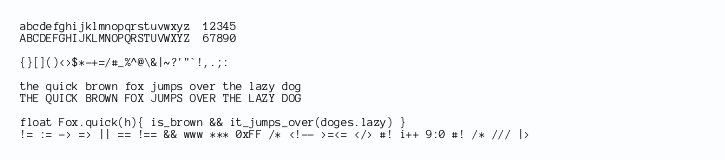

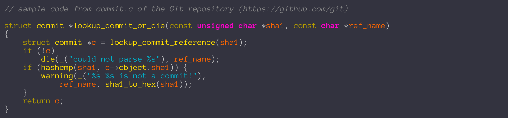
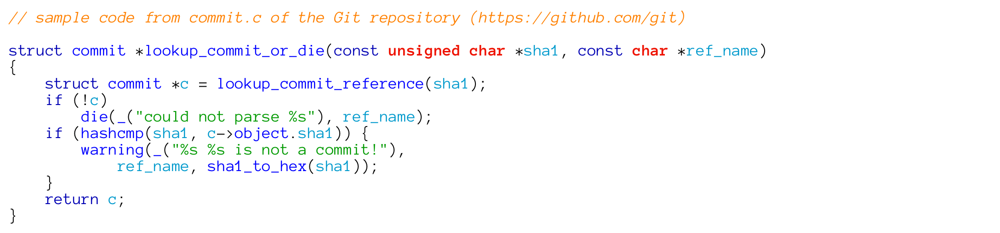


### [Aurulent Sans Mono](fonts/aurulent-sans-mono)

[ [License](fonts/aurulent-sans-mono/license.txt) ]


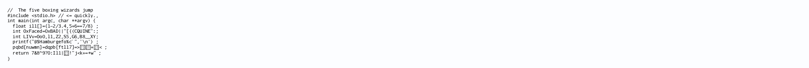
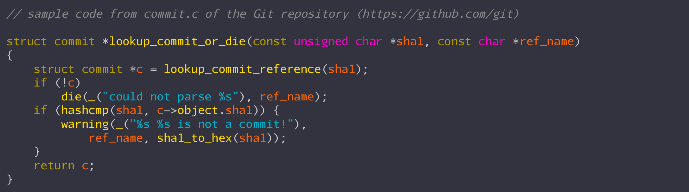
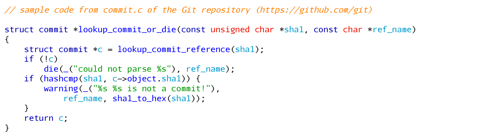


### [AverageMono](fonts/average-mono)

[ [License](fonts/average-mono/license.txt) ]


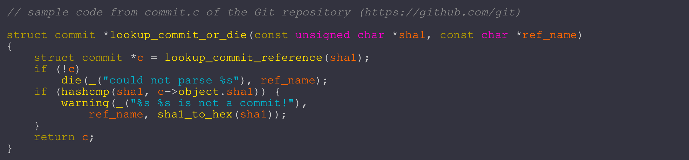


### [Bitstream Vera Sans Mono](fonts/bitstream-vera-sans-mono)

[ [License](fonts/bitstream-vera-sans-mono/license.txt) ]

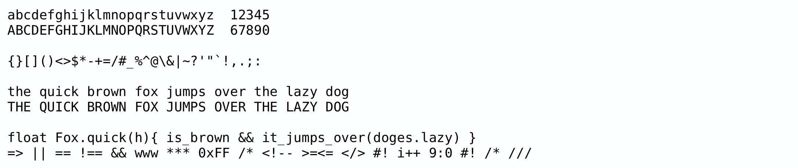


### [BPmono](fonts/bp-mono)

[ [License](fonts/bp-mono/license.txt) ]


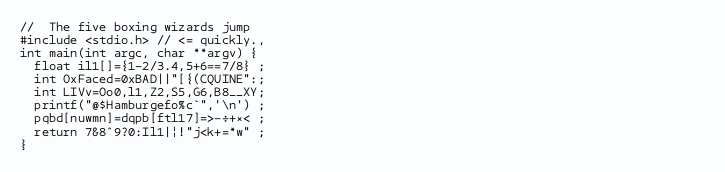
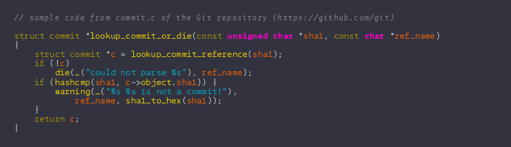


### [Bront](fonts/bront)

[ [License](fonts/bront/license.txt) ]


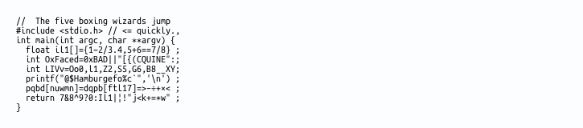
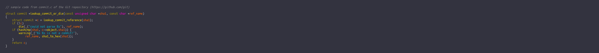
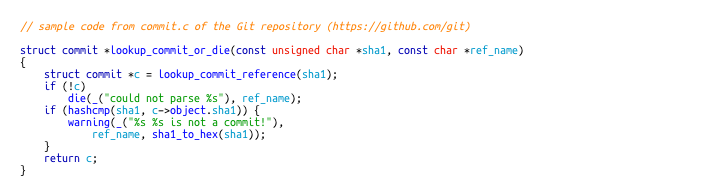


### [CamingoCode](fonts/camingo-code)

[ [License](fonts/camingo-code/license.txt) ]

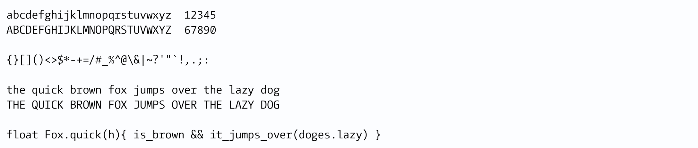
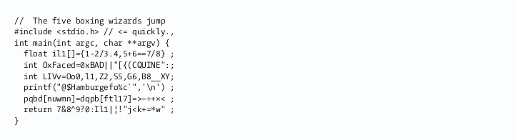
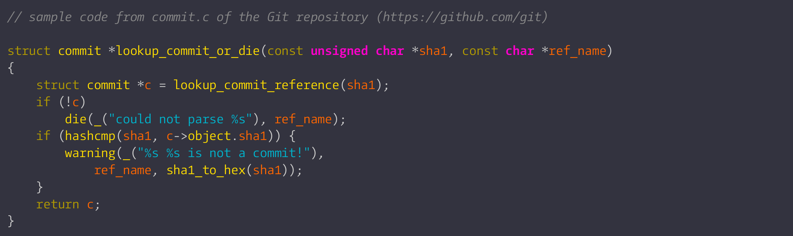


### [CMU Typewriter Text](fonts/cmu-typewriter)

[ [License](fonts/cmu-typewriter/license.txt) ]

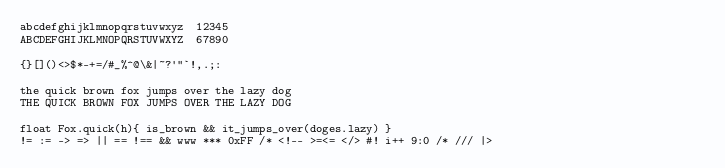
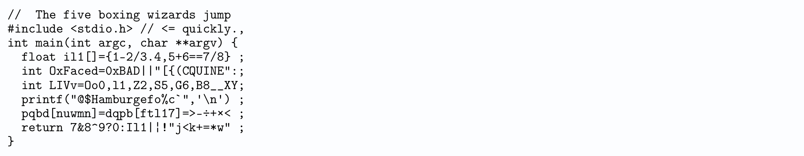
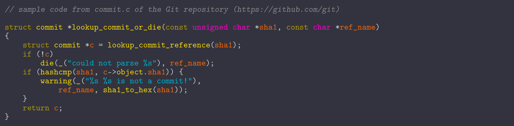
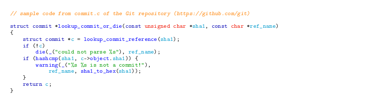


### [Code New Roman](fonts/code-new-roman)

[ [License](fonts/code-new-roman/license.txt) ]


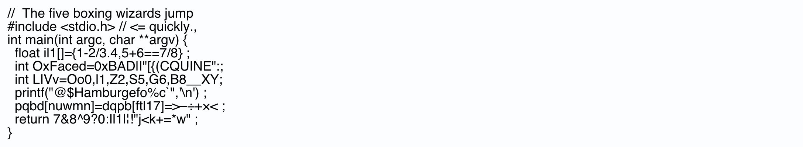
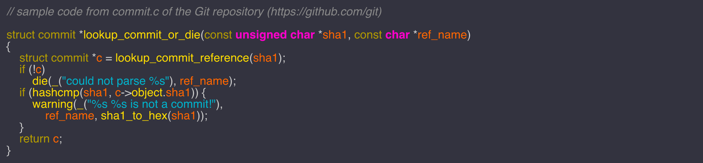
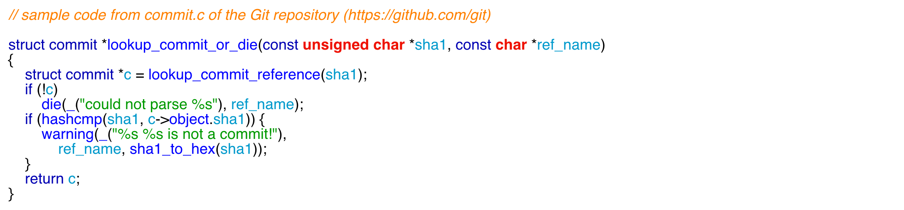


### [CodingFontTobi](fonts/coding-font-tobi)

[ [License](fonts/coding-font-tobi/license.txt) ]

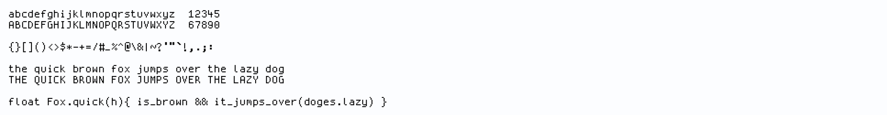
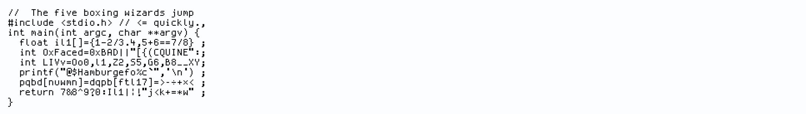
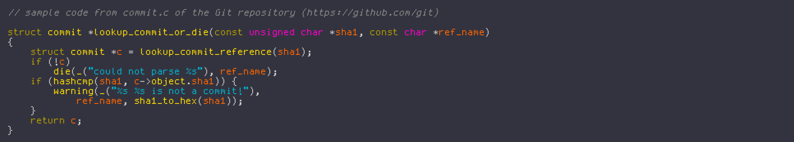
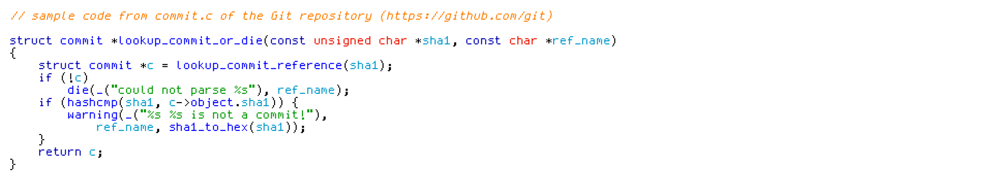


### [Consola Mono](fonts/consola-mono)

[ [License](fonts/consola-mono/license.txt) ]

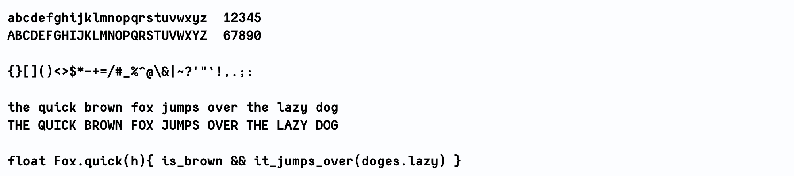
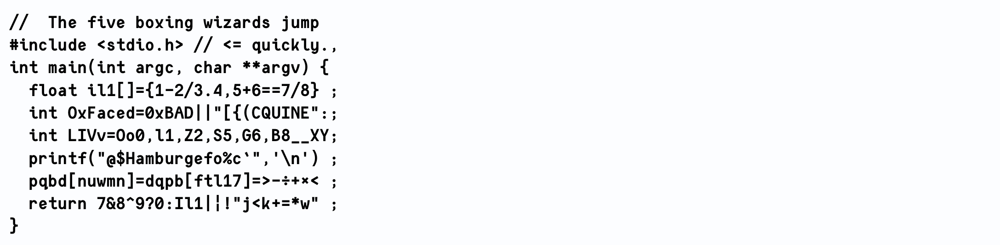
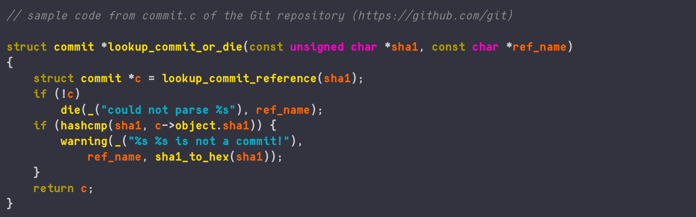
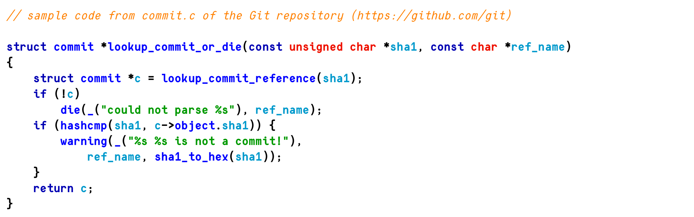


### [Courier Prime Code](fonts/courierprime-code)

[ [License](fonts/courierprime-code/license.txt) ]

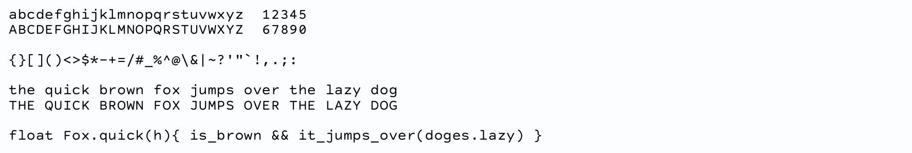
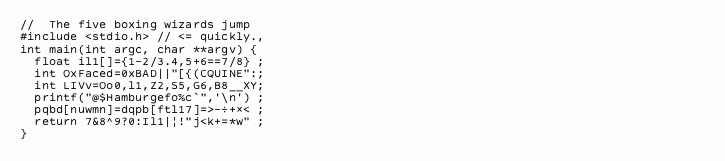
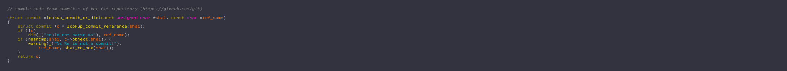


### [Cousine](fonts/cousine)

[ [License](fonts/cousine/license.txt) ]


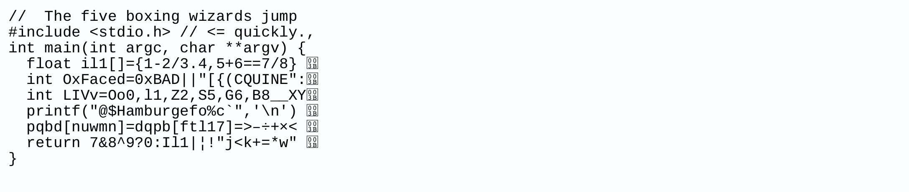
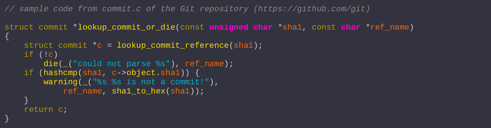
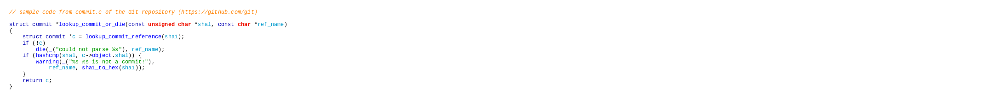


### [CPMono_v07](fonts/cp-mono)

[ [License](fonts/cp-mono/license.txt) ]

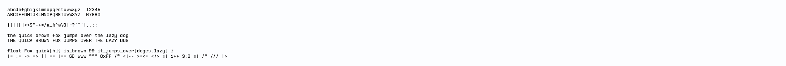
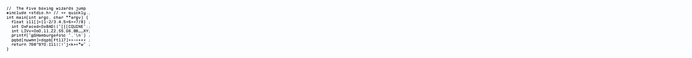
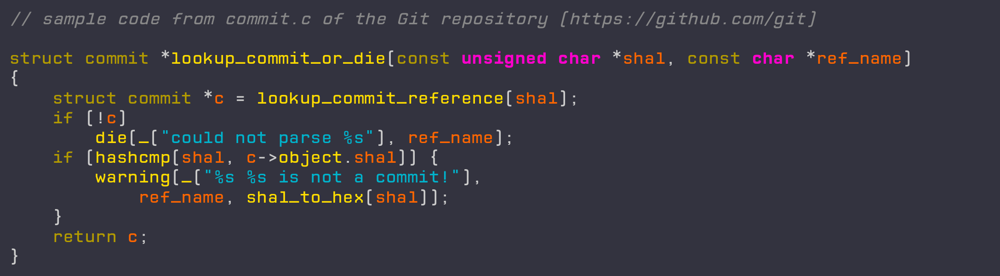
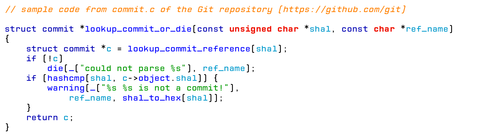


### [Crisp](fonts/crisp)

[ [License](fonts/crisp/license.txt) ]

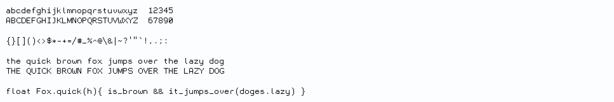

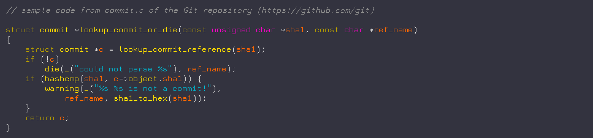
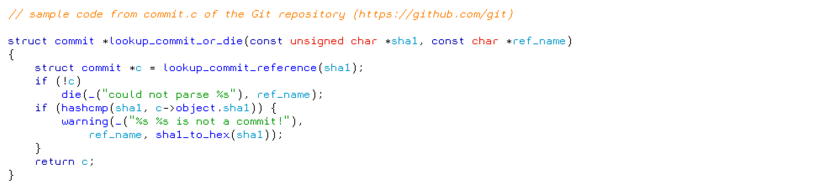


### [Cutive Mono](fonts/cutive-mono)

[ [License](fonts/cutive-mono/license.txt) ]


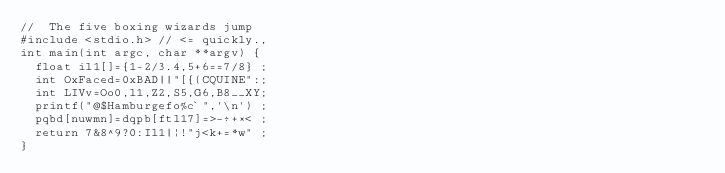
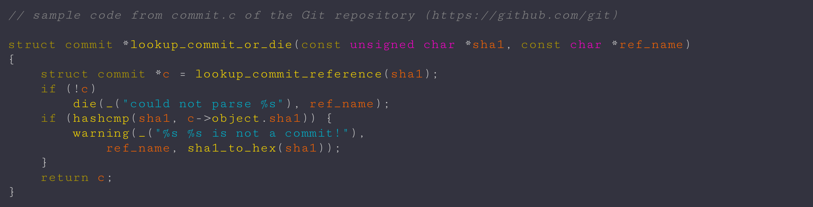


### [DejaVu Sans Mono](fonts/dejavu-sans-mono)

[ [License](fonts/dejavu-sans-mono/license.txt) ]

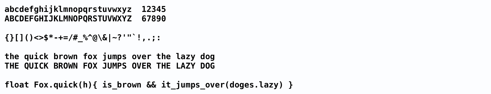
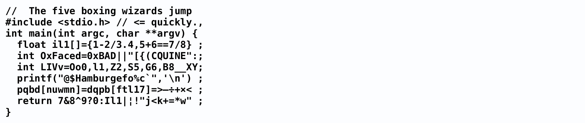
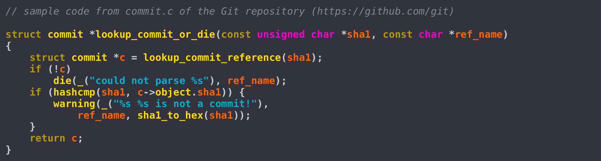
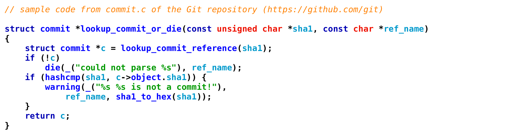


### [Dina ttf 10px](fonts/dina)

[ [License](fonts/dina/license.txt) ]


### [Droid Sans Mono](fonts/droid-sans-mono)

[ [License](fonts/droid-sans-mono/license.txt) ]


### [Edlo](fonts/edlo)

[ [License](fonts/edlo/license.txt) ]


### [Fantasque Sans Mono](fonts/fantasque-sans-mono)

[ [License](fonts/fantasque-sans-mono/license.txt) ]


### [Fira Code](fonts/fira-code)

[ [License](fonts/fira-code/license.txt) ]


### [Fira Mono](fonts/fira-mono)

[ [License](fonts/fira-mono/license.txt) ]


### [Fixedsys Excelsior 3.01](fonts/fixed-sys-excelsior)

[ [License](fonts/fixed-sys-excelsior/license.txt) ]


### [FreeMono](fonts/free-mono)

[ [License](fonts/free-mono/license.txt) ]


### [GohuFont](fonts/gohufont)

[ [License](fonts/gohufont/license.txt) ]


### [Hack](fonts/hack)

[ [License](fonts/hack/license.txt) ]


### [Hasklig](fonts/hasklig)

[ [License](fonts/hasklig/license.txt) ]


### [Hermit](fonts/hermit)

[ [License](fonts/hermit/license.txt) ]


### [Inconsolata](fonts/inconsolata)

[ [License](fonts/inconsolata/license.txt) ]


### [Iosevka](fonts/iosevka)

[ [License](fonts/iosevka/license.txt) ]


### [Latin Modern Mono Light 10](fonts/latin-modern-mono)

[ [License](fonts/latin-modern-mono/license.txt) ]


### [Lekton](fonts/lekton)

[ [License](fonts/lekton/license.txt) ]


### [Liberation Mono](fonts/liberation-mono)

[ [License](fonts/liberation-mono/license.txt) ]


### [Linux Libertine Mono](fonts/linux-libertine-mono)

[ [License](fonts/linux-libertine-mono/license.txt) ]


### [Luculent](fonts/luculent)

[ [License](fonts/luculent/license.txt) ]


### [Luxi Mono](fonts/luxi-mono)

[ [License](fonts/luxi-mono/license.txt) ]


### [Mensch](fonts/mensch)

[ [License](fonts/mensch/license.txt) ]


### [Meslo LG M DZ](fonts/meslo)

[ [License](fonts/meslo/license.txt) ]


### [Metrickal](fonts/metrickal)

[ [License](fonts/metrickal/license.txt) ]


### [monoOne](fonts/mono-one)

[ [License](fonts/mono-one/license.txt) ]


### [MonoSpatial](fonts/mono-spatial)

[ [License](fonts/mono-spatial/license.txt) ]


### [monofur](fonts/monofur)

[ [License](fonts/monofur/license.txt) ]


### [Monoid](fonts/monoid)

[ [License](fonts/monoid/license.txt) ]


### [Monospace](fonts/monospace)

[ [License](fonts/monospace/license.txt) ]


### [MonospaceTypewriter](fonts/monospace-typewriter)

[ [License](fonts/monospace-typewriter/license.txt) ]


### [MonteCarlo Fixed 12](fonts/monte-carlo)

[ [License](fonts/monte-carlo/license.txt) ]


### [M+ 1m](fonts/mplus1m)

[ [License](fonts/mplus1m/license.txt) ]


### [M+ 1mn](fonts/mplus1mn)

[ [License](fonts/mplus1mn/license.txt) ]


### [M+ 2m](fonts/mplus2m)

[ [License](fonts/mplus2m/license.txt) ]


### [NotCourierSans](fonts/not-courier-sans)

[ [License](fonts/not-courier-sans/license.txt) ]


### [Office Code Pro](fonts/office-code-pro)

[ [License](fonts/office-code-pro/license.txt) ]


### [Oxygen Mono](fonts/oxygen-mono)

[ [License](fonts/oxygen-mono/license.txt) ]


### [Panic Sans](fonts/panic-sans)

[ [License](fonts/panic-sans/license.txt) ]


### [Pointfree](fonts/pointfree)

[ [License](fonts/pointfree/license.txt) ]


### [ProFontWindows](fonts/pro-font-windows)

[ [License](fonts/pro-font-windows/license.txt) ]


### [PT Mono](fonts/pt-mono)

[ [License](fonts/pt-mono/license.txt) ]


### [Roboto Mono](fonts/roboto-mono)

[ [License](fonts/roboto-mono/license.txt) ]


### [saxMono](fonts/sax-mono)

[ [License](fonts/sax-mono/license.txt) ]


### [Share-TechMonoTrue](fonts/sharetech-mono)

[ [License](fonts/sharetech-mono/license.txt) ]


### [SmallTypeWriting](fonts/small-type-writing)

[ [License](fonts/small-type-writing/license.txt) ]


### [Source Code Pro](fonts/source-code-pro)

[ [License](fonts/source-code-pro/license.txt) ]


### [Sudo](fonts/sudo)

[ [License](fonts/sudo/license.txt) ]


### [SV Basic Manual](fonts/sv-basic-manual)

[ [License](fonts/sv-basic-manual/license.txt) ]


### [Terminus](fonts/terminus)

[ [License](fonts/terminus/license.txt) ]


### [TeX Gyre Cursor](fonts/tex-gyre-cursor)

[ [License](fonts/tex-gyre-cursor/license.txt) ]


### [Ubuntu Mono](fonts/ubuntu-mono)

[ [License](fonts/ubuntu-mono/license.txt) ]


### [Verily Serif Mono](fonts/verily-serif-mono)

[ [License](fonts/verily-serif-mono/license.txt) ]


### [Whois](fonts/whois-mono)

[ [License](fonts/whois-mono/license.txt) ]


---

§ The End
